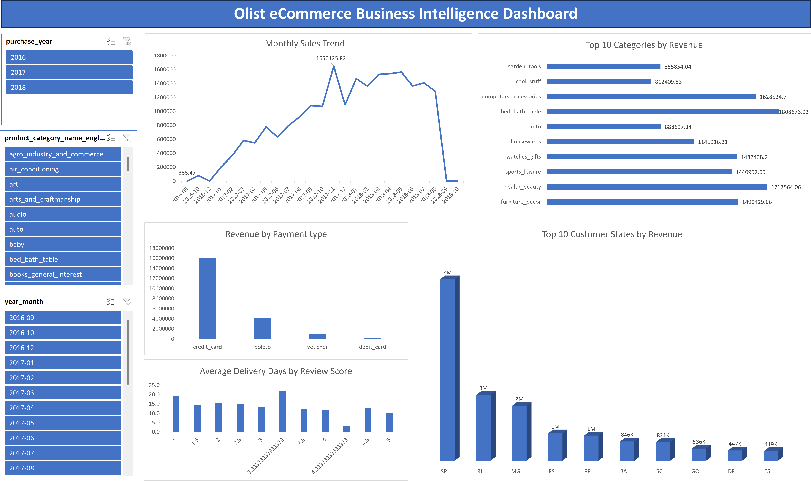
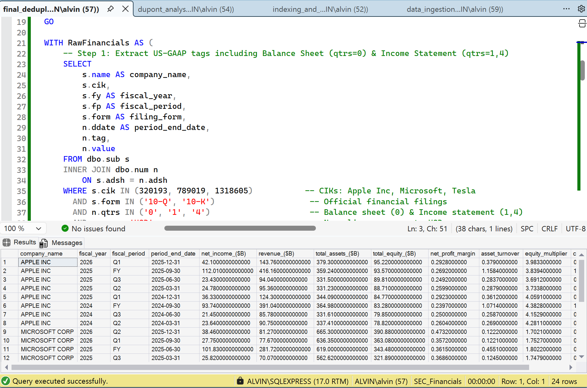

# 📊 Data Analyst Portfolio

### Excel • SQL • Power BI

---

Welcome to my data analyst portfolio. This repository showcases hands-on projects in **Excel**, **SQL**, and **Power BI**, each built to demonstrate practical, end-to-end analysis: from raw data to clear, decision-ready insights. Browse the projects below or visit the live portfolio site for interactive previews.

---

## 📂 Featured Projects

Each project below includes a short summary. Click through to the repo for full documentation, code, and screenshots.

### 1️⃣ Olist E-Commerce Analytics Dashboard (Excel)
**`📁 /excel-olist-ecommerce`**

> Dynamic Excel KPI dashboard and data model analyzing multi-million dollar e-commerce sales, logistics performance, and consumer payment preferences.

  

- **Goal:** Demystify e-commerce marketplace operations for Brazil's largest platform integrator (Olist) by consolidating over 99,000 fragmented relational order records into a centralized executive dashboard that tracks revenue velocity, regional growth drivers, and payment channel distribution.

- **Approach:** Cleaned and modeled raw multi-table relational datasets using **Power Query** to establish an optimal star schema. Engineered performant aggregation layers using **PivotTables**, implemented dynamic **KPI Summary Cards** via cross-sheet formula mapping, and deployed an interactive sidebar panel containing globally linked **Slicers and Timelines** to enable seamless cross-filtering across all visual elements.

- **Outcome:** Successfully mapped regional economic engines, identifying that **São Paulo (SP)** anchors the highest ecosystem value at **$8.01M**, outperforming secondary hubs like **Rio de Janeiro (RJ)** ($2.90M) and **Minas Gerais (MG)** ($2.42M). Isolated major consumer trends showing that **Health & Beauty** leads sector revenue at **$1.71M** and that credit lines heavily dominate platform velocity, capturing **$16.05M** in total processing volume compared to **$4.08M** via traditional bank invoices (*Boleto*).

**Skills demonstrated:** `Excel` `PivotTables` `Power Query` `Data Cleaning` `KPI Dashboards`

🔗 [View Project](https://github.com/alvino11/alvino11.github.io/tree/main/excel-olist-ecommerce)

---

### 2️⃣ SEC EDGAR Corporate Financial Analysis & DuPont ROE Pipeline (SQL)
**`📁 /sql-sec-dupont-analysis`**

> Dynamic T-SQL data pipeline processing 28M+ SEC EDGAR XBRL records to model corporate financial statements and deconstruct Return on Equity (ROE) using the 3-Step DuPont Identity.

  

- **Goal:** Modeled 8 quarters (~28 million rows) of raw, unstructured SEC EDGAR flat files in SQL Server (SSMS) to evaluate profitability, asset efficiency, and financial leverage for Apple, Microsoft, and Tesla.
- **Approach:** Engineered automated bulk ingestion loops, clustered index optimizations, and CTE-driven conditional aggregation to pivot vertical US-GAAP accounting tags and deduplicate restated filings via `ROW_NUMBER()` window functions.
- **Outcome:** Uncovered that Apple's >110% ROE is primarily driven by aggressive share repurchases elevating its Equity Multiplier (~3.84x–4.38x), whereas Microsoft's ROE (~29.65%) is powered by high net profit margins (~36%), and Tesla's lower ROE (~4.62%) reflects manufacturing capital intensity.

**Skills demonstrated:** `SQL Server (SSMS)` `T-SQL` `Window Functions` `CTEs` `Clustered Indexing` `Dynamic SQL` `DuPont Financial Analysis`

🔗 [View Project](sql-sec-dupont-analysis)

---

### 3️⃣ Enterprise Talent Retention Dashboard (Power BI)
**`📁 /powerbi-talent-retention`**

> End-to-end business intelligence solution using Kaggle HR infrastructure data, tracking workforce optimization and predictive turnover metrics.

  

- **Goal:** What decision-makers needed visibility into, and why.
- **Approach:** Data sources connected, data model design, DAX-driven measures, interactive dashboard structure.
- **Outcome:** What the dashboard enables, e.g., real-time tracking of turnover risk, self-service workforce reporting.

**Skills demonstrated:** `Power BI` `DAX` `Data Modeling` `Dashboard Design`

🔗 [View Project](#)

---

## 📫 More

🌐 **Full portfolio with live previews:** [alvino11.github.io](https://alvino11.github.io)

*Thanks for stopping by. Feedback on any of these projects is always welcome!*

